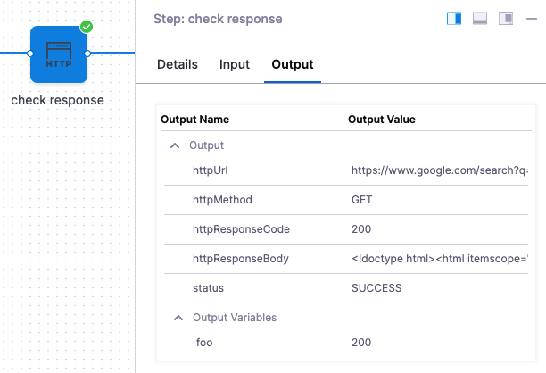

This topic describes the settings for the HTTP step.

You can use the HTTP step to run HTTP methods containing URLs, methods, headers, assertions, and variables.

## Name

The name of the step. You'll use this name when you reference the step settings.

For example, if the step name is HTTP and you want to reference the URL entered in its **URL** setting, use:

`<+pipeline.stages.tooltips.spec.execution.steps.HTTP.spec.url>`

## Timeout

The timeout for the step. Use:

* `w` for weeks
* `d` for days
* `h` for hours
* `m` for minutes
* `s` for seconds
* `ms` for milliseconds

The maximum is `53w`.

Timeouts can be set at the pipeline level also.

## URL

The URL for the HTTP call.

## Method

The [HTTP method](https://restfulapi.net/http-methods/#summary) to use in the step.

## Request body

The message body of the HTTP message.

## Assertion

Assertion is used to validate the incoming response. For example, if you wanted to check the health of an HTTP connection, use the assertion `<+httpResponseCode> == 200`.

The expression `<+httpResponseCode> == 200` will evaluate to true if the HTTP call returns a 200 code.

Expressions can use the following aliases to refer to the HTTP responses, URL, and method.

* `<+httpResponseCode>`
* `<+httpResponseBody>`

## Headers

Enter the media type for the message. For example, if you are using the GET method, the headers are used to specify the GET response body message type.

In **Key**, enter `Token`

In **Value**, enter `<+secrets.getValue("aws-playground_AWS_secret_key")>`

Another method:

* **Key**: `variable:`
* **Value**: `var1,var2:var3`

You can copy the key and paste it in the HTTP step **Header** setting. For more information, go to [Add and Manage API Keys](https://developer.harness.io/docs/platform/role-based-access-control/add-and-manage-api-keys/).

## Output

Create output variables to be used by other steps in the stage. The **Value** setting can contain any HTTP step input, output, or response information.

You can also use ​JSON and XML functors in the values for the output variable. For example, `<+json.select("data.attributes.version_pins.mvn-service://new-construction-api", httpResponseBody)>`.

For more information, go to [JSON and XML Functors](json-and-xml-functors.md).

## Step execution inputs and outputs

Once you execute your pipeline, the step displays its inputs and outputs and their values.

You can reference these anywhere in your pipeline.

### Inputs

In the following examples, the Id of the HTTP step is `HTTP`.

| **Input Name** | **Input Reference Example** | **Input Value Example** |
| --- | --- | --- |
| identifier | `<+pipeline.stages.HTTP.spec.execution.steps.check_response.identifier>` | check\_response |
| name | `<+pipeline.stages.HTTP.spec.execution.steps.check_response.name>` | check response |
| timeout | `<+pipeline.stages.HTTP.spec.execution.steps.check_response.timeout>` | 10s |
| type | `<+pipeline.stages.HTTP.spec.execution.steps.check_response.type>` | Http |
| url | `<+pipeline.stages.HTTP.spec.execution.steps.check_response.spec.url>` | https://www.google.com/search?q= |
| method | `<+pipeline.stages.HTTP.spec.execution.steps.check_response.spec.method>` | GET |
| requestBody | `<+pipeline.stages.HTTP.spec.execution.steps.check_response.spec.requestBody>` | current+date |
| assertion | `<+pipeline.stages.HTTP.spec.execution.steps.check_response.spec.assertion>` | `<+httpResponseCode> == 200` |

### Outputs

In the following examples, the Id of the HTTP step is `HTTP`.

| **Output** | **Output Reference Example** | **Output Value Example** |
| --- | --- | --- |
| httpUrl | `<+pipeline.stages.HTTP.spec.execution.steps.HTTP.output.httpUrl>` | `https://www.google.com/search?q=` |
| httpMethod | `<+pipeline.stages.HTTP.spec.execution.steps.HTTP.output.httpMethod>` | `GET` |
| httpResponseCode | `<+pipeline.stages.HTTP.spec.execution.steps.HTTP.output.httpResponseCode>` | `200` |
| httpResponseBody | `<+pipeline.stages.HTTP.spec.execution.steps.HTTP.output.httpResponseBody>` | `Hello` |
| status | `<+pipeline.stages.HTTP.spec.execution.steps.HTTP.output.status>` | `SUCCESS` |

## Advanced settings

In **Advanced**, you can use the following options:

* [Step Skip Condition Settings](../../../platform/8_Pipelines/w_pipeline-steps-reference/step-skip-condition-settings.md)
* [Step Failure Strategy Settings](../../../platform/8_Pipelines/w_pipeline-steps-reference/step-failure-strategy-settings.md)
* [Select Delegates with Selectors](/docs/platform/2_Delegates/manage-delegates/select-delegates-with-selectors.md)

## Header capability check

When Harness runs an HTTP step and connects to a service, it checks to make sure that an HTTP connection can be established.

Some services require HTTP headers to be included in connections. Without the headers, the HTTP connections fail and simple HTTP verification cannot be performed.

Harness performs an HTTP capability check with the headers included on the target service.

If the target host server require headers and you do not include headers in the **Headers** setting of the HTTP step, the Harness delegate will fail the deployment with the error `No eligible delegates could perform this task` (`error 400`).

Add the required headers in **Headers** and run the deployment. Adding the headers will prevent the `400` error.

Harness secrets are not used during capability checks. They are used in actual steps only. If you have a step configured with URLs and multiple headers like:

`x-api-key : <+secret.getValue('apikey')>`   
`content-type : application/json`

During a capability check, the non-secret headers are used as is but the secret headers are masked. Harness makes the HTTP request with the URL and headers as follows:

`x-api-key:<<<api_key>>>`  
`content-type:application/json`

This results in a `401 Unauthorized` response due to an incorrect api key. However, the capability check will be successful and the task will be assigned to the Harness delegate. 

:::note
Using `<<<and>>>` in HTTP requests might result in bad requests on the server side. In such cases, follow these workarounds.

* Use FF `CDS_NOT_USE_HEADERS_FOR_HTTP_CAPABILTY` to not use headers for capability checks.
* Use Shell script to run cURL command and manually process the response. 

:::

Capability checks are basic accessibilty checks and do not follow multiple redirects. Hence, Harness returns from the first `302 Found` response during capability checks. 

## See also

* [Shell Script Step Reference](shell-script-step.md)
* [JSON and XML Functors](json-and-xml-functors.md)

